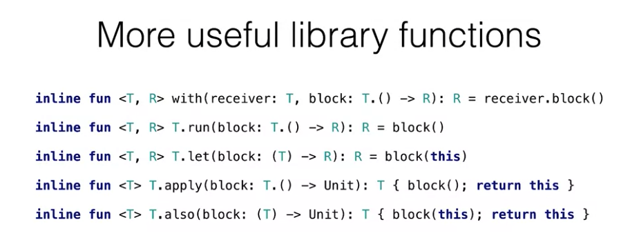
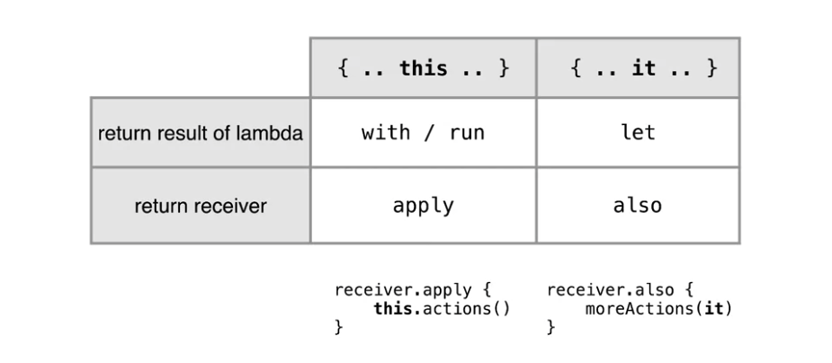

# lambdas

- syntax: curly braces
    - `{ parameters -> body }`
    - curly braces are highlighted in red in IntelliJ
    - `{ x: Int, y: Int -> x + y }`
- pass lambda as argument to a function
    - `list.any({i: Int -> i > 0 })`
    - if the lambda is the last or only argument, you can move it out of the `()`:
        - `list.any() {i: Int -> i > 0 }`
    - if the lambda is the only argument, you can omit the `()`:
        - `list.any {i: Int -> i > 0 }`
    - if the type can be inferred:
        - `list.any { i -> i > 0 }`
    - if the lambda has only one argument:
        - `list.any { it > 0 }`
- multi-line lambda:
    - ```
      list.any {
        println("processing $it")
        it > 0
      }
      ```
    - last expression in that block is the result
- destructuring
    - e.g. when lambda argument is a Pair:
    - `map.mapValues { entry -> ...entry.key... }` can be written as `map.mapValues { (key, value) -> ...key... }`
    - `map.mapValues { (_, value) -> ... }` is an argument is not used, so you don't have to think of a name
- collections
    - filter, map, groupBy, associate, zip, count, ...
    - result is again a Collection
        - this means it is not like the Java8 stream API!
        - these functions are eager and immediate
        - see sequences for the Java8 streams alternative in Kotlin
    - partition returns 2 collections! Is this a Pair under the hood?
- don't use `it` in complicated or multi-line lambda's
- you can store a lambda in a variable
  - `val f = { x: Int, y: Int -> x + y }`
  - the type is: `(Int, Int) -> Int`
  - you can also write it with the type explicitly: `val f: (Int, Int) -> Int = { x: Int, y: Int -> x + y }`
  - you can invoke a function stored in a variable
    - `f(3, 5)`
  - you can also pass the variable to another function that takes a lambda as argument
    - `list.filter(myPredicateVal)`
- you can invoke a lambda directly without storing it as a variable
  - `{ ... }()`
  - more readable: `run { ... }`
- nullability
  - function types that return nullable value VS nullable function types 
  - `() -> Int?` VS `(() -> Int)?`
  - how do you invoke a nullable function type?
    - `f()` won't compile
    - use an if statement and benefit of smart cast:
      - ```
        if (f != null) {
          f()
        }
        ```
      - use safe access:
        - `f?()` doesn't exist
        - it's: `f?.invoke()`
- returning
  - watch out with usage of return in a lambda!
  - ```
    fun duplicateNonZero(list: List<Int>): List<Int> {
        return list.flatMap {
            if (it == 0) return listOf()
            listOf(it, it)   
        }
    }
    ```
  - `return listOf()` jumps out of the function!
    - it does not return as part of the flatMap lambda
  - solutions
    - labels
      - `return@flatMap`
      - ```
        list.flatMap l@{
            if (it == 0) return@l listOf()
            listOf(it, it)   
        }
        ```
    - extract the body of the lambda as a function
      ```
      fun extracted(e: Int): List<Int> {
          if (e == 0) return listOf()
          listOf(e, e)   
      }
      return list.flatMap(::extracted)
      ```
    - anonymous functions
    - avoid the usage of return
      ```
      if (it == 0) {
        listOf()
      } else {
        listOf(it, it)
      }   
      ```
- "lambda with receiver" concept
    - ```
      val sb = StringBuilder()
      with (sb) {
        appendln("...")
        ...
      }
      ```
    - `with` is actually a function defined in the standard library
        - ```
          inline fun <T, R> with(
            receiver: T,
            block: T.() -> R 
          ): R = receiver.block()
          ```
        - you can also call it as `with(sb, { lambda... })`
        - for a function, if last argument is a lambda, it can be moved outside the parentheses
    - you can use `this`, which points to the first argument
        - `this` can also be omitted if you like
        - works a bit like extension functions, where this also points to the object of the class you're extending
    - you can store a "lambda with receiver" in a variable
        - normal lamda: `val isEven: (Int) -> Boolean = { it % 2 == 0 }`
            - call it: `isEven(0)`
        - lamda with receiver: `val isOdd: Int.() -> Boolean = { this % 2 == 1 }`
            - call it: `1.isOdd()`
    - other example: 
        ```
        inline fun buildString(builderAction: StringBuilder.() -> Unit): String {
        val stringBuilder = StringBuilder()
          stringBuilder.builderAction()
          return stringBuilder.toString() 
        }
      
        buildString {
          this.append("...")
        }
        ``` 
    - combination of with and extension functions is very powerful!
        - ```
          // an extension function for Cell is defined on Board
          // notice you can access Board internals in the implementation 
          override fun Cell.getNeighbour(direction: Direction): Cell? {
              return when(direction) {
                    UP -> getCellOrNull(this.i-1, this.j)
                    DOWN -> getCellOrNull(this.i+1, this.j)
                    LEFT -> getCellOrNull(this.i, this.j-1)
                    RIGHT -> getCellOrNull(this.i, this.j+1)
              }
          }
          
          // and you call it on a cell, with the context of a board
          // calling getNeighbour on Cell feels more natural then calling it on Board 
          with(board) {
              cell.getNeighbour(Direction.UP)
          }
          ```  
- more library functions:
    
    - `run`: like `with`, but with null safety
        - you can't protect against nullability when you do `with(f) { ... }`
        - use run together with safe access operator when receiver can be null
        - `f?.run { ... }` 
        - run is also used to run a block of code when there is no receiver
    - `let`: like `with`, but receiver is available as `it` instead of `this`
    - `apply`: like `with`, but returns the receiver as a result
    - `let`: like `apply`, but receiver is available as `it` instead of `this`
    
