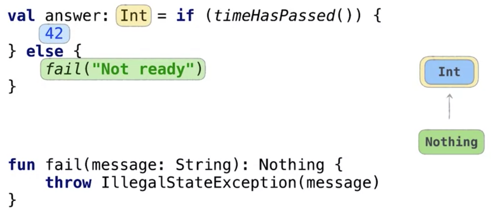

# types

- no primitive types in Kotlin
    - under the hood, at the bytecode level, an Int maps to a Java int and an Int? maps to a wrapper Integer
    - List<Int> is compiled to List<Integer>, because you can't use primitives in generics in Java
- Any
    - is a supertype for all non-nullable types
    - is replaced with Object
- type hierarchy
    - Any: top type in the hierarchy
    - Nothing: bottom type, is a subtype for all other types
    - Reminds me of Scala :-)
    - What is Nothing?
        - it's not void, there's Unit in Kotlin for that, which stands for a function that returns no meaningful value
        - Nothing is for a function that never returns / completes normally
            - because an exception is always thrown
            - because it contains an infinite while loop
            - see also TODO() function
        - whe you use `return`
        - Omdat Nothing een subtype is van alles, en omdat ge het throwen van een exception kunt voorstellen als type Nothing, hebt ge dit:
        
        - Nothing wordt trouwens naar Java ook omgezet naar void
    - er zijn ook nullable types: Any? en Nothing?
        - `var user = null` is van type Nothing? als je niet expliciet het type opgeeft
        - als je daarna `user = User("foo")` doet, krijg je terecht de fout `Nothing? was expected`
- nullable types & Java
    - types are under the hood implemented by using Java annotations (@Nullable or @NotNull)
    - Java types with these annotations are represented in Kotlin as non-nullable (e.g. Int) or nullable (e.g. Int?)
    - What if a Java type is encountered in Kotlin, and the type was not annotated with @Nullable or @NotNull?
        - then is is not nullable neither non-nullable, the nullability is unknown
        - Is represented with an exclamation mark, e.g. Int!
        - it's called a "platform type"
        - You can't declare it yourself in Kotlin
        - when you use these types in Kotlin, you can easily get NullPointerExceptions, because the code behaves as it would in Java
        - ```
          // Java
          String description = null; 
          // Kotlin
          println(description.length) // throws a NullPointerException
          ``` 
    - You can best annotate all your Java code
    - Or you can specify nullability by specifying the type (nullable or non-nullable) in Kotlin
        - if you specify it as non-nullable, e.g. String, but there's a null assigned, you get an IllegalStateException
        - this is done by something called Intrinsic checks ate bytecode level
- collections types and Java
    - in Kotlin, a read-only list is NOT immutable
    - it's just a mutable list, presented a an interface that lacks mutable methods :-)
    - it just helps to protect yourself, without Kotlin having to steer away from the existing Java Collections API